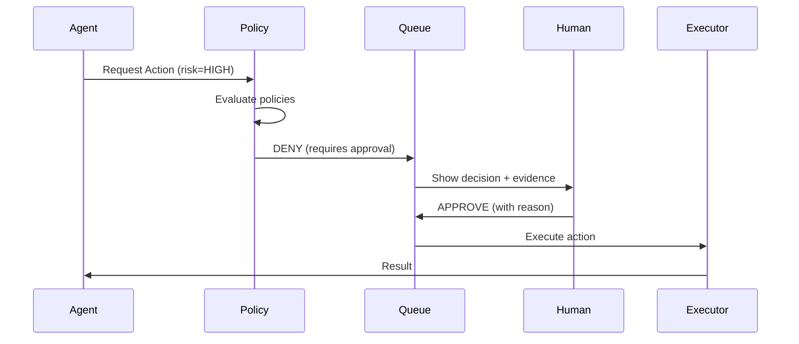
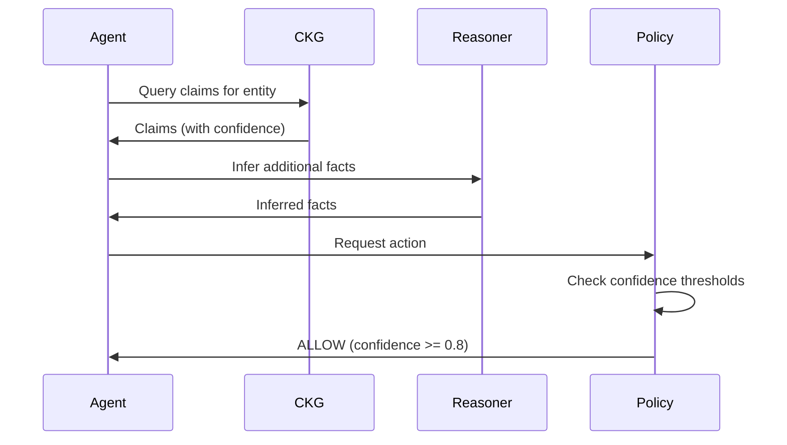
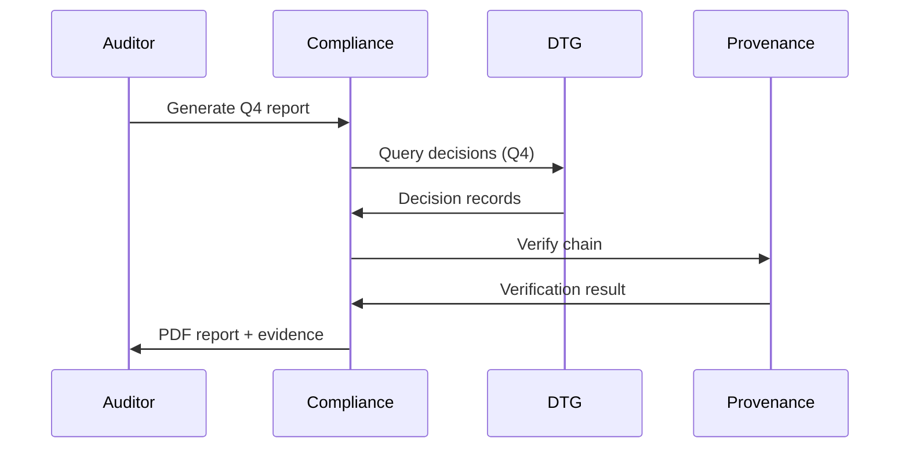

# Governance Deep Dive

How ContextGraph OS enforces governance at every layer.

## The Governance Problem

Traditional AI systems have a fundamental governance gap:

| What Exists | What's Missing |
|-------------|----------------|
| Logs | Audit trails |
| Prompts | Provenance |
| Outputs | Decision traces |
| Configs | Policy enforcement |

**ContextGraph OS closes this gap by making governance a first-class architectural concern.**

## Governance by Construction

### Principle 1: No Orphan Data

Every piece of data must have:
- A source
- A timestamp
- A confidence level
- A provenance record

```typescript
// This is enforced at the type level
interface Claim {
  id: ClaimId;
  source: ProvenanceSource;      // Required
  confidence: Confidence;         // Required
  validFrom: Timestamp;           // Required
  provenanceId: ProvenanceId;     // Auto-generated
}
```

### Principle 2: No Untraced Decisions

Every decision must be:
- Recorded before execution
- Evaluated against policies
- Traceable to evidence

```typescript
// Decision lifecycle is enforced
PROPOSED → APPROVED/REJECTED → EXECUTED → COMPLETED/FAILED
    │            │                │              │
    └────────────┴────────────────┴──────────────┘
                All states recorded
```

### Principle 3: Deny-First Policy

The default answer is "no". Actions must be explicitly allowed.

```yaml
# Default policy (implicit)
default:
  effect: deny
  reason: "No matching allow policy"

# Explicit allows override
explicit_allow:
  effect: allow
  subjects: [role:analyst]
  actions: [read]
  resources: [reports/*]
```

### Principle 4: Time is Truth

Data is always qualified by time:

```typescript
// Query: "What was the status on March 15?"
const claims = await ckg.query({
  entityId: projectId,
  asOf: createTimestamp('2024-03-15'),
});

// Returns claims valid on that date, not current claims
```

## Governance Layers

### Layer 1: Data Governance (CKG)

The Contextual Knowledge Graph enforces:

| Constraint | Enforcement |
|------------|-------------|
| Source required | Schema validation |
| Temporal validity | Query filtering |
| Confidence scores | Retrieval ranking |
| Contradictions | Explicit handling |

### Layer 2: Action Governance (Policy Engine)

Every action is policy-evaluated:

```
Action Request
     │
     ▼
┌─────────────────────────────────────┐
│         Policy Evaluation           │
│                                     │
│  1. Find matching policies          │
│  2. Evaluate conditions             │
│  3. Apply deny-takes-precedence     │
│  4. Return decision + reasons       │
└─────────────────────────────────────┘
     │
     ├── ALLOW → Execute
     │
     └── DENY → Exception Queue (optional)
                      │
                      └── Human Review
```

### Layer 3: Decision Governance (DTG)

All significant decisions tracked:

```typescript
interface Decision {
  id: DecisionId;
  type: string;
  status: DecisionStatus;

  // Who proposed this?
  proposedBy: AgentId;
  proposedAt: Timestamp;

  // What evidence was used?
  evidenceIds: ClaimId[];

  // What policy evaluated it?
  policyEvaluation: PolicyResult;

  // Who approved/rejected?
  approvedBy?: AgentId;
  rejectedBy?: AgentId;

  // Full audit trail
  history: DecisionEvent[];
}
```

### Layer 4: Audit Governance (Provenance)

Immutable, hash-chained records:

```
Entry 1 ──hash──► Entry 2 ──hash──► Entry 3
   │                │                 │
   └────────────────┴─────────────────┘
          Tamper-evident chain
```

## Governance Workflows

### Workflow 1: High-Risk Action Approval



### Workflow 2: Evidence-Weighted Decision



### Workflow 3: Compliance Audit



## Governance Metrics

Track governance health with these metrics:

| Metric | Good | Warning | Critical |
|--------|------|---------|----------|
| Policy deny rate | <10% | 10-30% | >30% |
| Approval latency | <1hr | 1-24hr | >24hr |
| Provenance chain valid | 100% | - | <100% |
| Decision trace coverage | 100% | 95-99% | <95% |

## Next Steps

- [Policy Configuration](./policy-configuration.md)
- [Decision Trace Graph](./decision-trace.md)
- [Compliance Reporting](./compliance-reporting.md)
