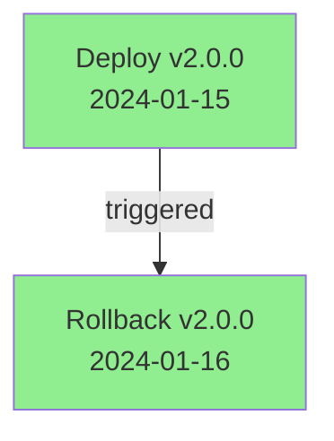
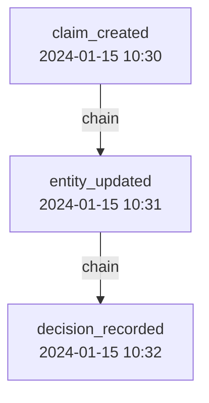
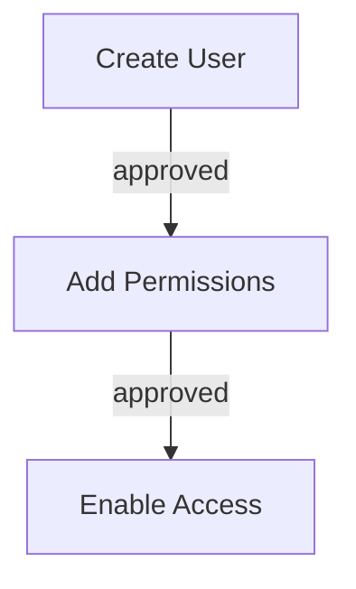

# Visualizing Decision Trees

Learn to visualize your decision history and provenance chains.

## What You'll Learn

- Generate decision tree diagrams
- Create provenance visualizations
- Export to different formats
- Embed in documentation

## Setup

```typescript
import { ContextGraph } from '@contextgraph/sdk';
import {
  visualizeDecisions,
  visualizeProvenance,
  visualizeEntities,
} from '@contextgraph/viz';

const client = await ContextGraph.create().then(r => r.value);
```

## Visualizing Decisions

### Mermaid Diagram

```typescript
const dtg = client.getDecisionTraceGraph();

const result = await visualizeDecisions(dtg, {
  format: 'mermaid',
  showTimestamps: true,
  colorScheme: 'default',
});

console.log(result.value);
```

Output:


### DOT Format

```typescript
const dotResult = await visualizeDecisions(dtg, {
  format: 'dot',
  showTimestamps: true,
});

// Save to file and render with Graphviz
fs.writeFileSync('decisions.dot', dotResult.value);
// dot -Tpng decisions.dot -o decisions.png
```

### SVG (Standalone)

```typescript
const svgResult = await visualizeDecisions(dtg, {
  format: 'svg',
  colorScheme: 'default',
});

fs.writeFileSync('decisions.svg', svgResult.value);
```

## Visualizing Provenance

### Chain Diagram

```typescript
const ledger = client.getProvenanceLedger();

const result = await visualizeProvenance(ledger, {
  format: 'mermaid',
  showTimestamps: true,
  maxDepth: 20,
});

console.log(result.value);
```

Output:


## Visualizing Entities

### Entity Relationship Graph

```typescript
const ckg = client.getCKG();

const result = await visualizeEntities(ckg, 'person', {
  format: 'd3',
  showLabels: true,
});

// Use with D3.js force-directed graph
const data = JSON.parse(result.value);
```

## Embedding in Documentation

### GitHub README

```markdown
## Decision History


```

### HTML Reports

```typescript
async function generateReport() {
  const decisions = await visualizeDecisions(dtg, { format: 'svg' });
  const provenance = await visualizeProvenance(ledger, { format: 'svg' });

  return `
<!DOCTYPE html>
<html>
<head><title>Audit Report</title></head>
<body>
  <h1>Decision History</h1>
  ${decisions.value}

  <h1>Provenance Chain</h1>
  ${provenance.value}
</body>
</html>
  `;
}
```

## Interactive Dashboard

### React Integration

```tsx
import { visualizeGraph } from '@contextgraph/viz';
import ForceGraph2D from 'react-force-graph-2d';

function DecisionGraph({ dtg }) {
  const [data, setData] = useState(null);

  useEffect(() => {
    async function loadGraph() {
      const graphData = await buildDecisionGraph(dtg);
      const result = visualizeGraph(graphData, { format: 'd3' });
      setData(JSON.parse(result.value));
    }
    loadGraph();
  }, [dtg]);

  if (!data) return <div>Loading...</div>;

  return (
    <ForceGraph2D
      graphData={data}
      nodeLabel="label"
      linkLabel="label"
      nodeColor={node => getNodeColor(node.type)}
    />
  );
}
```

## Color Schemes

| Scheme | Use Case |
|--------|----------|
| `default` | Standard colors |
| `dark` | Dark backgrounds |
| `light` | Light/pastel |
| `colorblind` | Accessible |

```typescript
await visualizeDecisions(dtg, {
  format: 'mermaid',
  colorScheme: 'colorblind',
});
```

## Next Steps

- [Temporal Queries](./temporal-queries.md)
- [Visualization Package](../packages/viz.md)
