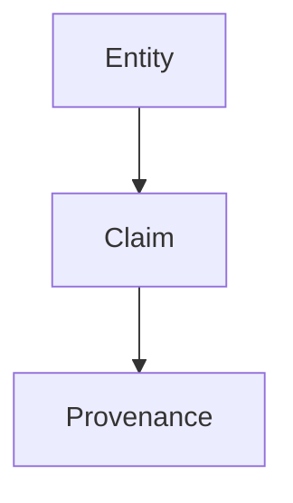
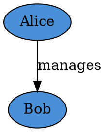
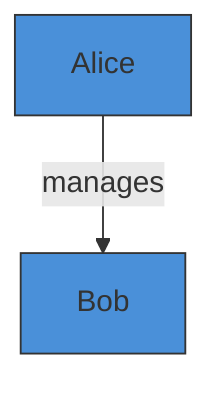
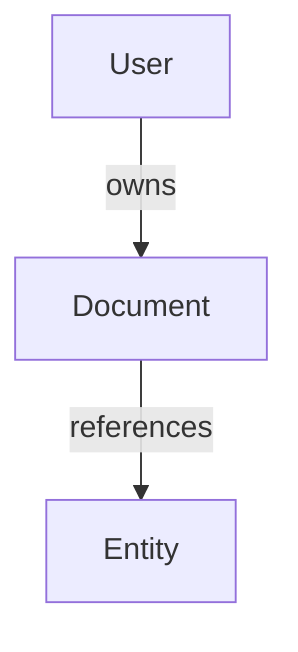

# @contextgraph/viz - Visualization Package

Visualization renderers for ContextGraph data structures. Generate visual representations of provenance chains, entity relationships, decision trees, and custom graphs in multiple formats.

## Table of Contents

- [Overview](#overview)
- [Installation](#installation)
- [Output Formats](#output-formats)
- [API Reference](#api-reference)
  - [visualizeProvenance](#visualizeprovenance)
  - [visualizeEntities](#visualizeentities)
  - [visualizeDecisions](#visualizedecisions)
  - [visualizeTimeline](#visualizetimeline)
  - [visualizeGraph](#visualizegraph)
- [Renderers](#renderers)
  - [DOT/Graphviz](#dotgraphviz)
  - [Mermaid](#mermaid)
  - [D3.js](#d3js)
  - [SVG](#svg)
- [Configuration](#configuration)
- [Examples](#examples)
- [Integration Guide](#integration-guide)

## Overview

The visualization package provides multiple rendering backends to visualize ContextGraph data:

| Format | Use Case | Interactive | Dependencies |
|--------|----------|-------------|--------------|
| DOT | GraphViz tools, CI/CD | No | Graphviz |
| Mermaid | Markdown docs, GitHub | No | Mermaid.js |
| D3.js | Web dashboards | Yes | D3.js |
| SVG | Standalone images | No | None |

## Installation

```bash
pnpm add @contextgraph/viz
```

## Output Formats

### DOT (Graphviz)

Standard graph description language. Use with Graphviz tools:

```bash
# Generate PNG
echo "$DOT_OUTPUT" | dot -Tpng -o graph.png

# Generate PDF
echo "$DOT_OUTPUT" | dot -Tpdf -o graph.pdf

# Generate SVG
echo "$DOT_OUTPUT" | dot -Tsvg -o graph.svg
```

### Mermaid

Markdown-compatible diagrams. Renders in GitHub, GitLab, and documentation sites:

```markdown

```

### D3.js

JSON format for D3.js force-directed graphs:

```javascript
const data = JSON.parse(d3Output);
// Use with d3.forceSimulation()
```

### SVG

Standalone SVG images with no external dependencies.

## API Reference

### visualizeProvenance

Visualize the provenance chain from a ProvenanceLedger.

```typescript
async function visualizeProvenance(
  ledger: ProvenanceLedger,
  options?: Partial<VizOptions>
): Promise<Result<string>>
```

**Parameters:**

| Name | Type | Description |
|------|------|-------------|
| `ledger` | `ProvenanceLedger` | The provenance ledger to visualize |
| `options` | `Partial<VizOptions>` | Visualization options |

**Returns:** `Result<string>` - The rendered output string

**Example:**

```typescript
import { visualizeProvenance } from '@contextgraph/viz';
import { ProvenanceLedger } from '@contextgraph/provenance';

const ledger = new ProvenanceLedger(storage);
await ledger.initialize();

// Record some provenance entries
await ledger.record({
  sourceType: 'human',
  actor: 'user_123',
  action: 'create',
  metadata: { entity: 'User profile' },
});

// Visualize as Mermaid diagram
const result = await visualizeProvenance(ledger, {
  format: 'mermaid',
  showTimestamps: true,
  colorScheme: 'default',
});

if (result.ok) {
  console.log(result.value);
  // Output:
  // graph TB
  //   prov_abc123["create<br/>2024-01-15"]
  //   prov_def456["update<br/>2024-01-16"]
  //   prov_abc123 -->|derives| prov_def456
}
```

### visualizeEntities

Visualize entity relationships from the Contextual Knowledge Graph.

```typescript
async function visualizeEntities(
  ckg: CKG,
  entityType: string,
  options?: Partial<VizOptions>
): Promise<Result<string>>
```

**Parameters:**

| Name | Type | Description |
|------|------|-------------|
| `ckg` | `CKG` | The Contextual Knowledge Graph |
| `entityType` | `string` | Type of entities to visualize |
| `options` | `Partial<VizOptions>` | Visualization options |

**Example:**

```typescript
import { visualizeEntities } from '@contextgraph/viz';
import { CKG } from '@contextgraph/ckg';

const ckg = new CKG(storage, provenance);
await ckg.initialize();

// Visualize person entities
const result = await visualizeEntities(ckg, 'person', {
  format: 'dot',
  showLabels: true,
  direction: 'LR',
});

if (result.ok) {
  // Write to file for Graphviz
  fs.writeFileSync('entities.dot', result.value);
}
```

### visualizeDecisions

Visualize the decision tree from a DecisionTraceGraph.

```typescript
async function visualizeDecisions(
  dtg: DecisionTraceGraph,
  options?: Partial<VizOptions>
): Promise<Result<string>>
```

**Parameters:**

| Name | Type | Description |
|------|------|-------------|
| `dtg` | `DecisionTraceGraph` | The Decision Trace Graph |
| `options` | `Partial<VizOptions>` | Visualization options |

**Example:**

```typescript
import { visualizeDecisions } from '@contextgraph/viz';
import { DecisionTraceGraph } from '@contextgraph/dtg';

const dtg = new DecisionTraceGraph(storage);
await dtg.initialize();

// Visualize with status colors
const result = await visualizeDecisions(dtg, {
  format: 'svg',
  showTimestamps: true,
  colorScheme: 'default',
});

if (result.ok) {
  fs.writeFileSync('decisions.svg', result.value);
}
```

### visualizeTimeline

Visualize a sequence of events on a timeline.

```typescript
function visualizeTimeline(
  events: TimelineEvent[],
  options?: Partial<VizOptions>
): Result<string>
```

**Parameters:**

| Name | Type | Description |
|------|------|-------------|
| `events` | `TimelineEvent[]` | Array of timeline events |
| `options` | `Partial<VizOptions>` | Visualization options |

**TimelineEvent Interface:**

```typescript
interface TimelineEvent {
  id: string;
  label: string;
  timestamp: number;
  type: 'entity' | 'claim' | 'decision' | 'provenance';
  metadata?: Record<string, unknown>;
}
```

**Example:**

```typescript
import { visualizeTimeline } from '@contextgraph/viz';

const events: TimelineEvent[] = [
  { id: '1', label: 'User Created', timestamp: Date.now() - 3600000, type: 'entity' },
  { id: '2', label: 'Profile Updated', timestamp: Date.now() - 1800000, type: 'claim' },
  { id: '3', label: 'Access Granted', timestamp: Date.now(), type: 'decision' },
];

const result = visualizeTimeline(events, {
  format: 'mermaid',
  direction: 'LR', // Left to right for timeline
});

console.log(result.value);
```

### visualizeGraph

Visualize custom graph data.

```typescript
function visualizeGraph(
  data: GraphData,
  options?: Partial<VizOptions>
): Result<string>
```

**GraphData Interface:**

```typescript
interface GraphData {
  nodes: GraphNode[];
  edges: GraphEdge[];
  title?: string;
  metadata?: Record<string, unknown>;
}

interface GraphNode {
  id: string;
  label: string;
  type: 'entity' | 'claim' | 'decision' | 'provenance' | 'agent';
  metadata?: Record<string, unknown>;
}

interface GraphEdge {
  from: string;
  to: string;
  type: string;
  label?: string;
  metadata?: Record<string, unknown>;
}
```

**Example:**

```typescript
import { visualizeGraph } from '@contextgraph/viz';

const data: GraphData = {
  title: 'Knowledge Graph',
  nodes: [
    { id: 'alice', label: 'Alice', type: 'entity' },
    { id: 'bob', label: 'Bob', type: 'entity' },
    { id: 'project', label: 'Project X', type: 'entity' },
  ],
  edges: [
    { from: 'alice', to: 'project', type: 'works_on', label: 'lead' },
    { from: 'bob', to: 'project', type: 'works_on', label: 'contributor' },
    { from: 'alice', to: 'bob', type: 'manages' },
  ],
};

const result = visualizeGraph(data, { format: 'd3' });
console.log(result.value); // JSON for D3.js
```

## Renderers

### DOT/Graphviz

The DOT renderer generates Graphviz-compatible output.

```typescript
import { renderDot } from '@contextgraph/viz';

const dot = renderDot(graphData, options);
```

**Output Example:**



**Node Shapes by Type:**

| Type | Shape |
|------|-------|
| entity | ellipse |
| claim | box |
| decision | diamond |
| provenance | hexagon |
| agent | doubleoctagon |

### Mermaid

The Mermaid renderer generates markdown-compatible diagrams.

```typescript
import { renderMermaid } from '@contextgraph/viz';

const mermaid = renderMermaid(graphData, options);
```

**Output Example:**



**Color Schemes:**

| Scheme | Description |
|--------|-------------|
| `default` | Standard colors |
| `dark` | Dark theme |
| `light` | Light/pastel theme |
| `colorblind` | Colorblind-friendly palette |

### D3.js

The D3.js renderer outputs JSON for force-directed graphs.

```typescript
import { renderD3, renderD3Config } from '@contextgraph/viz';

// Get graph data
const data = renderD3(graphData, options);

// Get recommended simulation config
const config = renderD3Config(options);
```

**Output Structure:**

```typescript
interface D3GraphData {
  nodes: D3Node[];
  links: D3Link[];
  metadata?: {
    title?: string;
    nodeCount: number;
    linkCount: number;
    groups: string[];
  };
}

interface D3Node {
  id: string;
  label: string;
  group: string;
  metadata?: Record<string, unknown>;
}

interface D3Link {
  source: string;
  target: string;
  label?: string;
  type: string;
  value: number;
}
```

**Integration Example:**

```html
<script src="https://d3js.org/d3.v7.min.js"></script>
<script>
const data = /* output from renderD3() */;
const config = /* output from renderD3Config() */;

const simulation = d3.forceSimulation(data.nodes)
  .force('link', d3.forceLink(data.links).id(d => d.id))
  .force('charge', d3.forceManyBody().strength(config.forces.charge.strength))
  .force('center', d3.forceCenter(width / 2, height / 2));
</script>
```

### SVG

The SVG renderer generates standalone SVG images.

```typescript
import { renderSvg } from '@contextgraph/viz';

const svg = renderSvg(graphData, options);
fs.writeFileSync('graph.svg', svg);
```

**Features:**

- Automatic layout calculation (BFS-based)
- Arrow markers for directed edges
- Node styling based on type
- Edge labels
- Configurable color schemes

## Configuration

### VizOptions

```typescript
interface VizOptions {
  /** Output format */
  format: 'dot' | 'mermaid' | 'd3' | 'svg';

  /** Show labels on nodes and edges */
  showLabels?: boolean;

  /** Show timestamps in labels */
  showTimestamps?: boolean;

  /** Maximum depth for traversal */
  maxDepth?: number;

  /** Color scheme */
  colorScheme?: 'default' | 'dark' | 'light' | 'colorblind';

  /** Graph direction */
  direction?: 'TB' | 'BT' | 'LR' | 'RL';

  /** Custom node styles by type */
  nodeStyles?: Record<string, NodeStyle>;

  /** Custom edge styles by type */
  edgeStyles?: Record<string, EdgeStyle>;
}
```

### NodeStyle

```typescript
interface NodeStyle {
  color?: string;
  fillColor?: string;
  shape?: 'circle' | 'rect' | 'diamond' | 'hexagon';
  size?: number;
}
```

### EdgeStyle

```typescript
interface EdgeStyle {
  color?: string;
  width?: number;
  style?: 'solid' | 'dashed' | 'dotted';
}
```

### Default Options

```typescript
const DEFAULT_OPTIONS: VizOptions = {
  format: 'mermaid',
  showLabels: true,
  showTimestamps: false,
  maxDepth: 10,
  colorScheme: 'default',
  direction: 'TB',
};
```

## Examples

### Provenance Audit Report

```typescript
import { visualizeProvenance } from '@contextgraph/viz';
import { ProvenanceLedger } from '@contextgraph/provenance';

async function generateAuditReport(ledger: ProvenanceLedger) {
  // Generate Mermaid diagram for documentation
  const mermaidResult = await visualizeProvenance(ledger, {
    format: 'mermaid',
    showTimestamps: true,
    colorScheme: 'default',
  });

  // Generate SVG for PDF report
  const svgResult = await visualizeProvenance(ledger, {
    format: 'svg',
    showTimestamps: true,
    direction: 'TB',
  });

  return {
    markdown: `## Provenance Chain\n\n\`\`\`mermaid\n${mermaidResult.value}\n\`\`\``,
    svg: svgResult.value,
  };
}
```

### Interactive Dashboard

```typescript
import { visualizeGraph } from '@contextgraph/viz';

async function getDashboardData() {
  const graphData = await buildGraphFromDatabase();

  const result = visualizeGraph(graphData, {
    format: 'd3',
    colorScheme: 'dark',
  });

  return JSON.parse(result.value);
}

// In React/Vue component
const dashboardData = await getDashboardData();
// Use with react-force-graph or similar
```

### Entity Relationship Diagram

```typescript
import { visualizeEntities } from '@contextgraph/viz';

async function generateERD(ckg: CKG, entityType: string) {
  const result = await visualizeEntities(ckg, entityType, {
    format: 'dot',
    showLabels: true,
    direction: 'LR',
    nodeStyles: {
      entity: { fillColor: '#e3f2fd', shape: 'rect' },
    },
    edgeStyles: {
      references: { style: 'dashed', color: '#1976d2' },
    },
  });

  return result.value;
}
```

## Integration Guide

### With Graphviz

```bash
# Install Graphviz
brew install graphviz  # macOS
apt install graphviz   # Ubuntu

# Generate image from DOT output
node generate-dot.js | dot -Tpng -o output.png
```

### With Mermaid CLI

```bash
# Install Mermaid CLI
npm install -g @mermaid-js/mermaid-cli

# Generate image from Mermaid output
node generate-mermaid.js > diagram.mmd
mmdc -i diagram.mmd -o output.png
```

### With GitHub

Mermaid diagrams render automatically in GitHub:

```markdown
# Knowledge Graph


```

### With React

```tsx
import { visualizeGraph } from '@contextgraph/viz';
import ForceGraph2D from 'react-force-graph-2d';

function GraphViewer({ graphData }) {
  const d3Data = useMemo(() => {
    const result = visualizeGraph(graphData, { format: 'd3' });
    return JSON.parse(result.value);
  }, [graphData]);

  return (
    <ForceGraph2D
      graphData={d3Data}
      nodeLabel="label"
      linkLabel="label"
    />
  );
}
```

### With Express API

```typescript
import express from 'express';
import { visualizeProvenance } from '@contextgraph/viz';

const app = express();

app.get('/api/provenance/diagram', async (req, res) => {
  const format = req.query.format || 'svg';

  const result = await visualizeProvenance(ledger, { format });

  if (!result.ok) {
    return res.status(500).json({ error: result.error.message });
  }

  const contentType = format === 'svg' ? 'image/svg+xml' :
                      format === 'd3' ? 'application/json' : 'text/plain';

  res.setHeader('Content-Type', contentType);
  res.send(result.value);
});
```

## Supported Formats Summary

| Feature | DOT | Mermaid | D3.js | SVG |
|---------|-----|---------|-------|-----|
| Provenance Chains | ✅ | ✅ | ✅ | ✅ |
| Entity Relationships | ✅ | ✅ | ✅ | ✅ |
| Decision Trees | ✅ | ✅ | ✅ | ✅ |
| Timelines | ✅ | ✅ | ✅ | ✅ |
| Custom Graphs | ✅ | ✅ | ✅ | ✅ |
| Color Schemes | ✅ | ✅ | ✅ | ✅ |
| Custom Styles | ✅ | ✅ | ✅ | ✅ |
| Interactive | ❌ | ❌ | ✅ | ❌ |
| Standalone | ❌ | ❌ | ❌ | ✅ |
